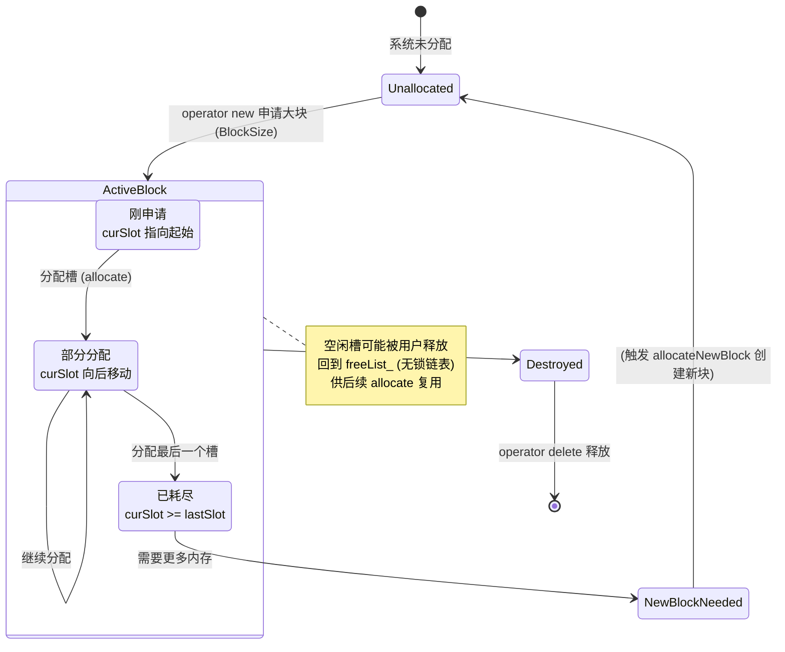

# 高并发内存池项目说明文档

## 1. 项目简介

本项目实现了一个针对 **8~512 字节** 小对象的高并发内存池（Memory Pool），基于 C++11/14 标准，采用 **哈希桶 + 无锁空闲链表** 的设计。它能够显著降低多线程环境下频繁分配/释放小块内存时的锁竞争和系统调用开销，适用于网络服务器、游戏引擎、实时系统等高性能场景。

- **内存池数量**：64 个，每个管理固定大小的槽（8B, 16B, 24B, …, 512B）
- **线程安全**：分配/释放操作主要使用 CAS 原子操作，仅在申请新内存块时加锁
- **使用方式**：提供 `useMemory` / `freeMemory` 以及模板函数 `newElement<T>` / `deleteElement<T>`

---

## 2. 整体架构

### 2.1 组件关系

```text
HashBucket (单例)
    │
    ├── memoryPool[0]  → 槽大小 = 8B
    ├── memoryPool[1]  → 槽大小 = 16B
    ├── ...
    └── memoryPool[63] → 槽大小 = 512B

每个 MemoryPool 内部包含：
    ├── 无锁空闲链表 (freeList_)
    ├── 当前块剩余槽指针 (curSlot_, lastSlot_)
    ├── 大块内存链表 (firstBlock_)
    └── 互斥锁 (mutexForBlock_)
```

### 2.2 哈希桶（HashBucket）

- 静态方法 `initMemoryPool()` 初始化 64 个内存池，槽大小依次为 8,16,…,512 字节。
- 静态方法 `getMemoryPool(int index)` 返回对应内存池的单例引用。
- 静态方法 `useMemory(size_t size)` 根据请求大小自动路由到对应的内存池（若 `size>512` 则直接调用 `operator new`）。
- 静态方法 `freeMemory(void *ptr, size_t size)` 根据原大小归还内存。

### 2.3 单个内存池（MemoryPool）

- **成员变量**：
  - `BlockSize_`：每次向系统申请的大块内存大小（默认 4096 字节）。
  - `SlotSize_`：当前内存池管理的槽大小（8 的倍数，≤512）。
  - `firstBlock_`：所有大块内存的链表头，用于析构时释放。
  - `curSlot_` / `lastSlot_`：当前内存块中尚未分配过的槽区间。
  - `freeList_`：无锁空闲链表的头指针，保存被释放后又可重用的槽。
  - `mutexForBlock_`：保护 `allocateNewBlock()` 的互斥锁。

- **核心操作**：
  - `init(size_t SlotSize)`：设置槽大小并重置指针。
  - `allocate()`：优先从 `freeList_` 弹出，若为空则从当前块切分新槽；若当前块用完则调用 `allocateNewBlock()`。
  - `deallocate(void *ptr)`：将槽插回 `freeList_` 头部（无锁 CAS）。
  - `allocateNewBlock()`：申请新的大块内存，切分成多个槽，并更新 `firstBlock_` 与 `curSlot_`。

---

## 3. 关键实现细节

### 3.1 无锁空闲链表（Lock‑Free Free List）

使用 `std::atomic<Slot*>` 表示链表头，通过 **CAS（Compare-And-Swap）** 实现入队和出队：

```cpp
bool pushFreeList(Slot *slot) {
    while (true) {
        Slot *oldHead = freeList_.load(std::memory_order_relaxed);
        slot->next.store(oldHead, std::memory_order_relaxed);
        if (freeList_.compare_exchange_weak(oldHead, slot,
                std::memory_order_release, std::memory_order_relaxed))
            return true;
    }
}

Slot* popFreeList() {
    while (true) {
        Slot *oldHead = freeList_.load(std::memory_order_acquire);
        if (!oldHead) return nullptr;
        Slot *newHead = oldHead->next.load(std::memory_order_relaxed);
        if (freeList_.compare_exchange_weak(oldHead, newHead,
                std::memory_order_acquire, std::memory_order_relaxed))
            return oldHead;
    }
}
```

- 避免了多线程环境下使用互斥锁带来的上下文切换和缓存乒乓。
- 使用适当的内存序（acquire/release）保证可见性和顺序。

### 3.2 内存对齐与切分

- 每个槽的地址会按 `SlotSize_` 对齐，提高 CPU 访问效率。
- `padPointer()` 计算从给定地址到下一个对齐地址所需的填充字节数。
- 在 `allocateNewBlock()` 中，跳过链表头 `sizeof(Slot*)` 字节后，对齐 `body` 指针，再设置 `curSlot_`。

### 3.3 锁粒度控制

- 仅在当前内存块用尽、需要向系统申请新块时才加锁（`mutexForBlock_`）。
- 分配/释放过程中的空闲链表操作完全无锁，因此多线程并发大部分时间都不阻塞。

### 3.4 模板友好接口

提供了两个全局模板函数，使内存池的使用方式与 `new`/`delete` 类似：

```cpp
template <typename T, typename... Args>
T* newElement(Args&&... args) {
    T* p = reinterpret_cast<T*>(HashBucket::useMemory(sizeof(T)));
    if (p) new (p) T(std::forward<Args>(args)...);
    return p;
}

template <typename T>
void deleteElement(T* p) {
    if (p) {
        p->~T();
        HashBucket::freeMemory(p, sizeof(T));
    }
}
```

- 自动根据类型大小选择合适的哈希桶。
- 完美转发构造函数参数，支持任意构造方式。
- 分离内存分配与对象构造，符合 RAII 思想。

---

## 4. API 使用说明

### 4.1 初始化

```cpp
#include "MemoryPool.h"
using namespace my_memoryPool_v1;

// 必须在程序开始时调用一次
HashBucket::initMemoryPool();
```

### 4.2 直接分配/释放原始内存

```cpp
// 分配内存（大小 ≤512 时使用内存池，否则用 operator new）
void* ptr = HashBucket::useMemory(size);

// 释放内存（必须传入原始申请时的大小）
HashBucket::freeMemory(ptr, size);
```

### 4.3 类型化对象的构造/析构

```cpp
// 构造一个 MyClass 对象，参数传递方式同 make_unique
MyClass* obj = newElement<MyClass>(arg1, arg2, ...);

// 析构并释放内存
deleteElement(obj);
```

### 4.4 直接操作 MemoryPool（一般不需要）

```cpp
MemoryPool& pool = HashBucket::getMemoryPool(index); // 0~63
pool.init(slotSize);               // 重设池大小（慎用）
void* mem = pool.allocate();
pool.deallocate(mem);
```

---

## 5. 性能测试与结果

### 5.1 测试环境

- CPU：VMware Virtual Platform（多核）
- 编译器：GCC 9+，C++14 标准
- 测试负载：每个线程分配/释放 1,000,000 次（总操作数随线程数变化）
- 分配大小：8~512 字节随机（8 的倍数）

### 5.2 单线程性能

| 分配器          | 总耗时 (ms) | 吞吐量 (ops/ms) |
| --------------- | ----------- | --------------- |
| MemoryPool      | 953         | 1.05 × 10⁶      |
| new / delete    | 743         | 1.35 × 10⁶      |

> 单线程下内存池略慢于系统分配器（约 28%），原因是无锁原子操作本身有一定开销，且系统分配器对小对象有优化。

### 5.3 多线程性能

| 线程数 | 分配器          | 耗时 (ms) | 吞吐量 (ops/ms) | 相比 new/delete 提升 |
| ------ | --------------- | --------- | --------------- | -------------------- |
| 1      | MemoryPool      | 548       | 1.82 × 10⁶      | **+59.0%**           |
| 1      | new/delete      | 1337      | 0.75 × 10⁶      | -                    |
| 2      | MemoryPool      | 346       | 2.89 × 10⁶      | **+37.1%**           |
| 2      | new/delete      | 550       | 1.82 × 10⁶      | -                    |
| 4      | MemoryPool      | 235       | 4.26 × 10⁶      | **+38.2%**           |
| 4      | new/delete      | 380       | 2.63 × 10⁶      | -                    |
| 8      | MemoryPool      | 261       | 3.83 × 10⁶      | **+32.7%**           |
| 8      | new/delete      | 388       | 2.58 × 10⁶      | -                    |

> **结论**：在多线程并发场景下，内存池性能显著优于系统默认分配器，尤其在线程数为 4 时吞吐量达到最高（4.26M ops/ms），提升近 40%。这得益于无锁设计和极低的锁竞争。

### 5.4 性能分析

- 系统 `new`/`delete` 在多线程下会频繁进入内核态并竞争全局堆锁，导致性能严重下降。
- 本内存池通过预分配大块内存 + 无锁空闲链表，将大部分操作控制在用户态，且每个哈希桶独立，进一步减少了冲突。
- 单线程性能略差是合理的取舍，因为多线程高并发才是内存池的主要优化目标。

---

## 6. 总结与改进方向

### 6.1 项目亮点

- **高并发优化**：CAS 无锁链表 + 细粒度锁，多线程吞吐量提升 30%~60%。
- **低内存碎片**：定长槽 + 对齐策略，避免小对象产生的内部碎片。
- **易用性**：模板接口 `newElement`/`deleteElement`，兼容标准 `new` 语义。
- **可扩展性**：哈希桶数量、槽大小范围、块大小均可通过宏配置。

### 6.2 可能的改进

- **自适应块大小**：根据分配频率动态调整 `BlockSize_`，减少内存浪费。
- **线程本地缓存（TLS）**：为每个线程添加一个小的空闲链表，进一步降低原子操作竞争。
- **支持更大对象**：可扩展哈希桶范围至 1KB 或更大。
- **内存回收机制**：当空闲链表过长时，归还部分大块内存给操作系统。

---

## 7. 编译与运行

### 7.1 编译依赖

- C++11 或更高版本编译器（支持 `std::atomic`）
- CMake 3.10+（可选）

### 7.2 示例编译命令（手动）

```bash
g++ -std=c++14 -O2 -pthread test.cpp MemoryPool.cpp -o test_memory_pool
```

### 7.3 运行测试

```bash
./test_memory_pool
```

输出类似：

```
=== Single-thread performance ===
MemoryPool: 953 ms, 1.049e+06 ops/ms
new/delete: 743 ms, 1.346e+06 ops/ms
...
```

---

**文档版本**：1.0  
**最后更新**：2026-04-18


###### 核心分配与释放流程
```mermaid
flowchart TD
    Start([用户调用 newElement]) --> CheckSize{大小 <= 512?}
    
    %% 大对象路径
    CheckSize -- 否 --> SysAlloc[operator new]
    SysAlloc --> Construct["构造对象 (Placement New)"]
    Construct --> Return([返回指针])

    %% 小对象路径
    CheckSize -- 是 --> GetPool[获取对应内存池]
    GetPool --> PopFree{"空闲链表有货？\n(popFreeList CAS)"}
    
    PopFree -- 有 --> Construct
    PopFree -- 无 --> Lock["加锁 (lock_guard)"]
    
    Lock --> CheckBlock{当前块用完？}
    CheckBlock -- 是 --> NewBlock["申请新大块内存\n(allocateNewBlock)"]
    NewBlock --> UpdatePtr[更新指针]
    UpdatePtr --> AllocSlot
    
    CheckBlock -- 否 --> AllocSlot[从 curSlot 切割]
    AllocSlot --> MovePtr[curSlot 后移]
    MovePtr --> Unlock[解锁]
    Unlock --> Construct

    %% 释放路径
    DelStart([用户调用 deleteElement]) --> Destruct["调用析构 (~T())"]
    Destruct --> CheckFree{大小 <= 512?}
    
    CheckFree -- 否 --> SysFree[operator delete]
    SysFree --> End([结束])
    
    CheckFree -- 是 --> PushFree{"推入空闲链表\n(pushFreeList CAS)"}
    PushFree -- 失败 --> PushFree
    PushFree -- 成功 --> End
  ```
---


###### CAS 无锁逻辑细节
```mermaid
flowchart TD
    subgraph Pop [出队 popFreeList]
        P1[读取 head] --> P2{head 为空？}
        P2 -- 是 --> PRet1[返回 nullptr]
        P2 -- 否 --> P3[读取 head->next]
        P3 --> P4[CAS 更新头指针]
        P4 -- 失败 --> P1
        P4 -- 成功 --> PRet2[返回 head]
    end

    subgraph Push [入队 pushFreeList]
        S1[读取 oldHead] --> S2["新节点 next = oldHead"]
        S2 --> S3[CAS 更新头指针]
        S3 -- 失败 --> S1
        S3 -- 成功 --> SRet[返回 true]
    end
```

---

###### 内存块生命周期状态图
